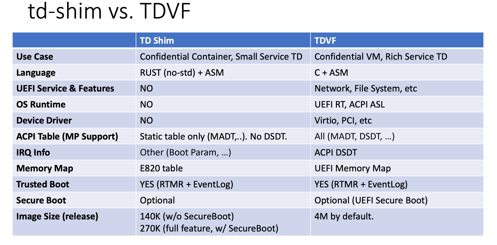

# Design and Hardening Decisions in meta-dstack Layer

## Overview

The meta-dstack layer is designed to create a minimally secure image for booting Confidential Virtual Machines (CVMs). Our design philosophy prioritizes attack surface reduction while maintaining TDX-aware functionality. This document outlines the architectural decisions and trade-offs made during development.

## Key Design Decisions

### 1. Yocto Kernel Recipe Selection

**Decision**: We use `linux-yocto-dev` (development recipes) instead of `linux-yocto` (stable recipes).

**Rationale**: We use Scarthgap version of Yocto, which is the latest version when we started the dstack project. The stable `linux-yocto` recipe in Scarthgap is based on kernel 6.6 which does not support RTMR[1-2]. So we switch to `linux-yocto-dev` to get the kernel 6.9 support. The latest released Yocto (Walnascar) updated kernel to 6.12 which meets our requirements. We plan to upgrade the Yocto version later, but this is not trivial as all downstream Yocto recipes need to be updated to adapt to the major Yocto version change.

### 2. TDVF vs td-shim Boot Firmware

**Decision**: We use Intel's TDVF implementation integrated in OVMF rather than td-shim.

**Current State**: **TDVF** is a mature, proven solution currently in use. **td-shim** is a Rust-based implementation aimed at minimizing attack surface.

**Rationale**: td-shim cannot currently boot our dstack system successfully. td-shim is considered too new for production use in our current requirements. TDVF provides stable, tested functionality for our TDX requirements.



### 3. TDX Guest Driver Implementation

**Decision**: We disable the built-in TDX guest driver (`CONFIG_TDX_GUEST_DRIVER=n`) and use a custom implementation.

**Rationale**: **Primary Goal** is to enable RTMR3 extension capabilities. **Custom Driver Benefits** include enhanced measurement and attestation features, better integration with our security architecture, and flexibility for dstack-specific optimizations.

**Implementation Notes**: Builds upon proven meta-confidential-compute foundation. Maintains compatibility with TDX specifications. Adds value-specific functionality without compromising security.

### 4. Randomness Generation and Seeding

**Security Requirement**: Ensure cryptographically secure randomness without trusting the host system.

We configure the kernel with specific command-line arguments:

```
random.trust_cpu=y
random.trust_bootloader=n
```

`random.trust_cpu=y` enables trust in CPU-provided randomness (Intel RDRAND). `random.trust_bootloader=n` prevents untrusted host-provided entropy.

Intel RDRAND hardware RNG instruction. System Integration: Proper seeding of `/dev/random` and `/dev/urandom`. Application Support: Ensures container and application randomness needs.

See [here](https://intel.github.io/ccc-linux-guest-hardening-docs/security-spec.html#linux-rng) for more details.

### 5. Secure System Time

**Implementation**: dstack OS enforces the guest kernel uses TSC as the only timer source by appending `tsc=reliable no-kvmclock` to the kernel cmdline. It also enforces the use of NTS with built-in [trusted servers](https://github.com/Dstack-TEE/meta-dstack/blob/bef2dfa850f4116ae4ece96d8c0948965c5874b3/meta-dstack/recipes-core/chrony/files/chrony.conf#L13-L20) to synchronize system time.

**Behavior**: When `secure_time` is enabled in the app-compose.json configuration, the system ensures time synchronization is completed before requesting application keys. If `secure_time` is disabled, time synchronization is not enforced before application launch.

**Rationale**: Time synchronization is provided as an optional feature because the process typically requires tens of seconds to complete. Applications can function without the `secure_time` option enabled and may implement their own time synchronization mechanisms if required.

See [here](https://intel.github.io/ccc-linux-guest-hardening-docs/security-spec.html#tsc-and-other-timers) for more details.
